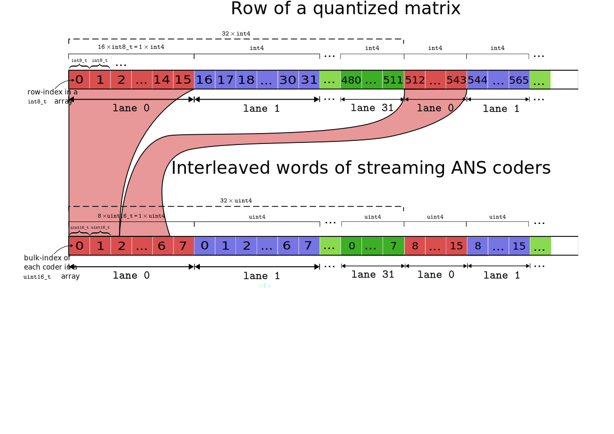

# MatVANS: Fast Quantized Matrix-Vector Multiplication via Entropy Coding on the GPU
### This repository is still work in progress!

This repository, explores various approaches to GPU-kernels for low-precision
matrix-vector multiplications, where the matrix is held in GPU memory in comppressed form to reduce memory bandwidth and thus potentially speed up the
(heavily memory-bound) operation. 

Here, “compressed” does not just mean that
the matrix is quantized to low bit-widths; it means that the matrix is entropy coded,
i.e., memory bandwidth is further reduced by exploiting the statistical distribution
of matrix elements (think “gzip for matrices” but with better compression ratio and faster decoding).

Our motivation for this exploration is to speed up inference in large language models (LLMs) on edge devices, where integer matrix-vector multiplication is often the computational bottleneck.

The figure below illustrates one implemented mapping from raw matrix elements to their compressed representation.

See our [whitepaper](https://github.com/wildug/MatVANS/blob/main/unfinished_MatVANS_whitpaper.pdf) for further details.

Our proposed method is chmpetitive with standard quantized matrix-vector kernels (implemented in the `baseline_int/` directory) but **requires significantly less memory**.




## Structure of the project:

- python script `create_matfiles.py` for creating required compressed and raw binaries `.bin` 
- the `baselines` folder contains `cuBLAS_baseline_float/` and `baseline_int8/` as the single precision floating point number and 8-bit integer baseline
- `buffered/` and `matvansWarpPerRow/` contains the source code of two variants out proposed method

## creating and writing dummy-weights files
First make sure that you have created your `*matrices*.bin` files by using `create_matfiles*.py` in each corresponding folder.
To run `create_matfiles.py` simply execute 
```bash
python create_matfiles*.py
```
in the terminal and adapt the variables to your needs.

## Compiling your own binaries
First, adapt the path in the respective kernel to the location of your dummy weights file created in step beforehand.
 To achieve this change the `filename` string variable the respective`*.cu` files.
To compile your own binary run inside one of the three folders
```bash
mkdir build && cd build && cmake .. 
```
if you want to debug the kernel run `cmake` with
```bash
mkdir build && cd build && cmake -DCMAKE_BUILD_TYPE=Debug ..
```
after a succesful `make` execute `./baseline` or `./matvans` 

To check if a binary includes the required debug symbols, run:
```bash
file binary_file
```


## further setup notes
CUDA kernels can be compiled manually with `nvcc` or using `cmake`. When using a `CMakeLists.txt`, linking to **cuBLAS** or **cuBLASLt** is required. To enable kernel debugging in VSCode, a `launch.json` file needs to be placed in the `.vscode/` directory. The program should be compiled manually (by running `make`) before debugging to include the latest changes. Alternatively, one can define a `tasks.json` to automate the build step. Debugging is very similar to host-based programming, except you can specify the inspected thread and block using the format block

```
(a,0,0) thread (x,0,0)
```

A more manual approach involves placing 
`printf("...",...)` statements inside conditionals like `if (... && threadIdx.x == x).`
